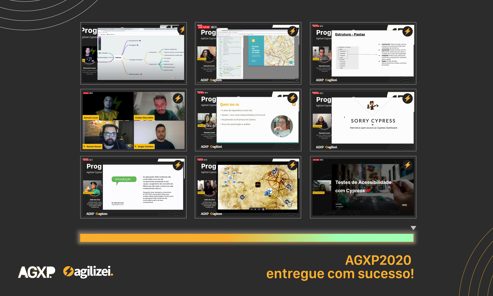

<h1 align="center">AGXP2020</h1>

<h2 align="center">Agilizei Cypress Conference</h2>

O Agilizei Cypress Conference aka AGXP foi uma conferência online com 3 dias de palestras - 15, 16 e 17 de Dezembro às 19hs - falando sobre Cypress e diversos assuntos relacionados. Foi transmitido ao vivo no Youtube, e foram 10 palestrantes convidados, mais de 7 horas de conteúdo e cerca de 500 pessoas impactadas durante o evento. 

<h3 align="center">Confira os palestrantes e palestras do evento ⚡️</h3>

|       Palestrante        |                                Assunto                                 |                                            Material                                             |
|:------------------------:|:----------------------------------------------------------------------:|:-----------------------------------------------------------------------------------------------:|
|                          |                                                                        |                                                                                                 |
|    Ben-Hur Santos Ott    |                     Testes de segurança e Cypress                      |                            [link](apresentacoes/5minsec_agxp.2.pdf)                             |
|       Bruno Pulis        |                  Testes de acessibilidade com Cypress                  |                 [link](apresentacoes/brunopulisdev_cypress_acessibilidade.pdf)                  |
| Cleiber, Renato e Sergio |  Experiências de trabalho para empresas de Portugal, Canadá e Irlanda  |                                                -                                                |
|     Ernesto Barbosa      |          Sorry Cypress: uma alternativa ao Cypress Dashboard           |                      [link](apresentacoes/jose_ernesto_sorry_cypress.pdf)                       |
|      Júlio de Lima       |     ALTER FACE: Uma heurística para testar aplicações Web modernas     |                 [link](apresentacoes/julio_ALTER_FACE_Test_Heuristic_PT_BR.pdf)                 |
|    Maximiliano Alves     |                 Testes de APIs com Cypress e ServeRest                 |                [link](apresentacoes/max_teste_suas_apis_utilizando_cypress.pdf)                 |
|     Rebeca Ferreira      | Happy: testando uma aplicação com Typescript, Maps e Upload de imagens | [link](apresentacoes/rebeca_testando_uma_aplicacao_com_typeScript_maps_e_upload_de_imagens.pdf) |
|       Samuel Lucas       |           Cypress: evolução, roadmap e perguntas frequentes            |                   [link](apresentacoes/samuel_abertura_roadmap_AGXP2020.pdf)                    |
|      Taís Mafioleti      |                          Cypress vs TestCafe                           |                       [link](apresentacoes/tais_cypress_vs_testcafe.pdf)                        |

<h3 align="center">Confira os 3 dias de evento ⚡️</h3>

|                                           Dia                                            |               Link para vídeo               |
|:----------------------------------------------------------------------------------------|:-------------------------------------------:|
|         AGXP2020 - Dia 01 - Roadmap, APIs, Typescript, Maps e Upload de imagens          | [link](https://www.youtube.com/watch?v=udB1cWJkfc8) |
| AGXP2020 - Dia 02 - Experiências em Portugal, Canadá e Irlanda, TestCafe e Sorry Cypress | [link](https://www.youtube.com/watch?v=sK90Ya46htk) |
|      AGXP2020 - Dia 03 - ALTER FACE, Testes de acessibilidade e Testes de segurança      | [link](https://www.youtube.com/watch?v=udB1cWJkfc8) |

<h2 align="center">⭐️ Deixe seu star para o evento ⭐️ </h2>
